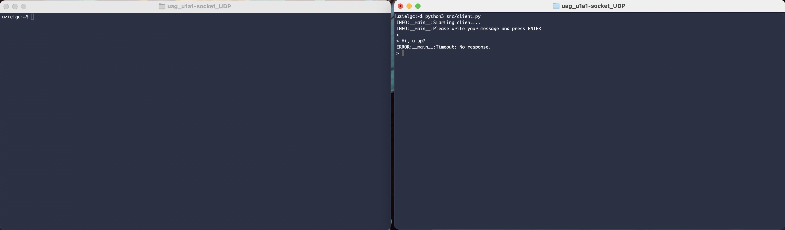
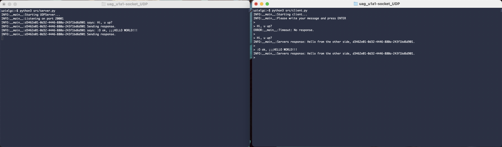

## U1 A1: Socket UDP

### Author: Eloy Uziel García Cisneros (eloy.garcia@edu.uag.mx)

## Documentación

El código fuente se encuentra dentro de la carpeta [src](src).

Al correr el cliente se entra en un ciclo que espera un texto del usuario, para enviar al servidor presione ENTER.

Cliente abre socket y escribe mensajes sin servidor. (sockets no orientados a conexión)

Cliente y servidor corriendo en procesos independientes.

Cliente (.py), servidor y un cliente adicional usando la utilería `ncat` (nc -u <IP> <PUERTO>)
donde -u utiliza UDP en lugar de la opción por default (TCP).

### Validación/Uso

Correr server:
    `python src/server.py`

Correr cliente:
    `python src/client.py`

