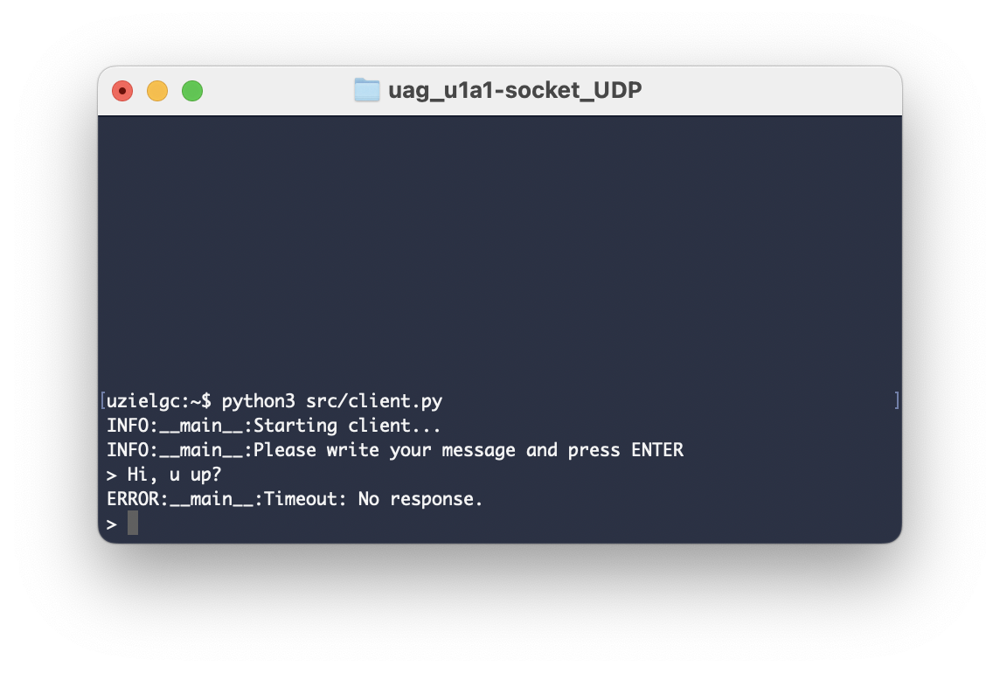
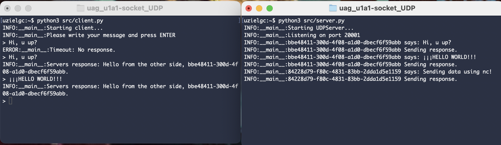
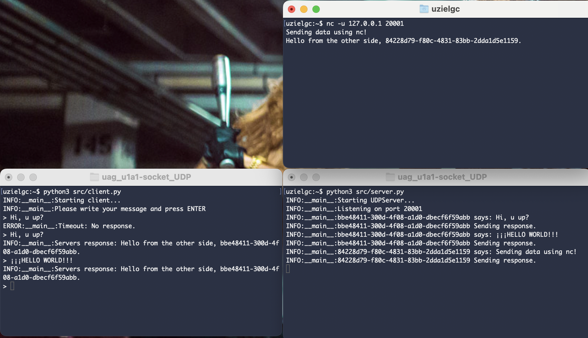

## U1 A1: Socket UDP

### Author: Eloy Uziel García Cisneros (eloy.garcia@edu.uag.mx)
#### Repo: https://github.com/uzielgc/uag_u1a1-socket_UDP

## Documentación

El código fuente se encuentra dentro de la carpeta [src](src).
La evidencia en imagenes se encuentra en la carpeta [images](images).
El código esta comentado en los puntos clave del proceso.

Al correr el cliente se entra en un ciclo que espera un texto del usuario, para enviar al servidor presione ENTER.

Cliente abre socket y escribe mensajes sin servidor. (sockets no orientados a conexión).
Log de error solo porque no recibe respuesta del servidor, sin embargo el mensaje fue enviado.



Cliente y servidor corriendo en procesos independientes.



Cliente (.py), servidor y un cliente adicional usando la utilería `ncat` (nc -u <IP> <PUERTO>)
donde -u utiliza UDP en lugar de la opción por default (TCP).



### Validación/Uso

Correr server:
    `python src/server.py`

Correr cliente:
    `python src/client.py`

### Ooutput

Terminal 1 cliente:
```
uzielgc:~$ python3 src/client.py 
INFO:__main__:Starting client...
INFO:__main__:Please write your message and press ENTER
> Hi, u up?
ERROR:__main__:Timeout: No response.
> Hi, u up?
INFO:__main__:Servers response: Hello from the other side, bbe48411-300d-4f08-a1d0-dbecf6f59abb.
> ¡¡¡HELLO WORLD!!!
INFO:__main__:Servers response: Hello from the other side, bbe48411-300d-4f08-a1d0-dbecf6f59abb.
> 
```

Terminal 2 servidor:
```
uzielgc:~$ python3 src/server.py
INFO:__main__:Starting UDPServer...
INFO:__main__:Listening on port 20001
INFO:__main__:bbe48411-300d-4f08-a1d0-dbecf6f59abb says: Hi, u up?
INFO:__main__:bbe48411-300d-4f08-a1d0-dbecf6f59abb Sending response.
INFO:__main__:bbe48411-300d-4f08-a1d0-dbecf6f59abb says: ¡¡¡HELLO WORLD!!!
INFO:__main__:bbe48411-300d-4f08-a1d0-dbecf6f59abb Sending response.
INFO:__main__:84228d79-f80c-4831-83bb-2dda1d5e1159 says: Sending data using nc!
INFO:__main__:84228d79-f80c-4831-83bb-2dda1d5e1159 Sending response.
```

Terminal 3 - nc:
```
uzielgc:~$ nc -u 127.0.0.1 20001
Sending data using nc!
Hello from the other side, 84228d79-f80c-4831-83bb-2dda1d5e1159.

```